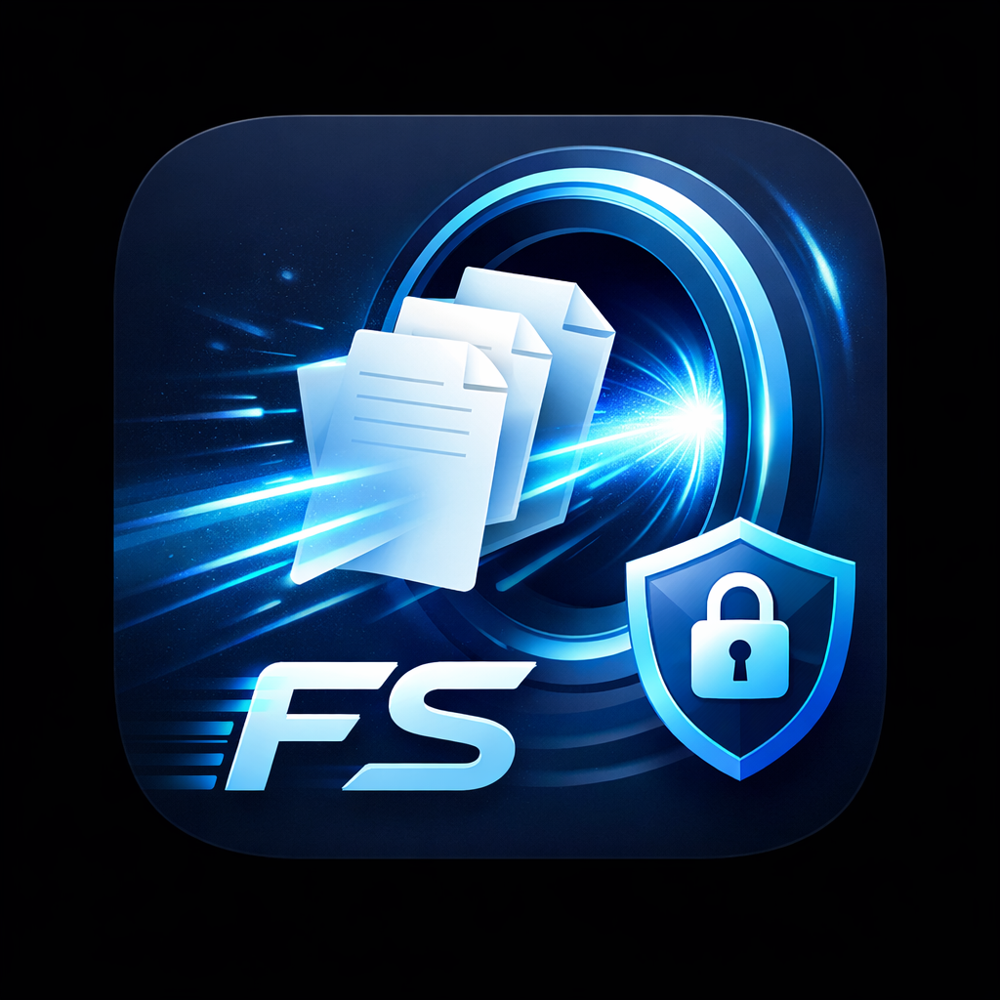
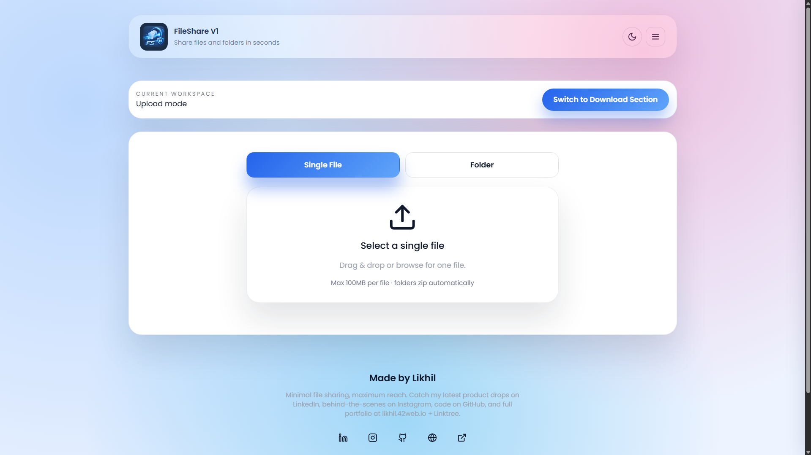
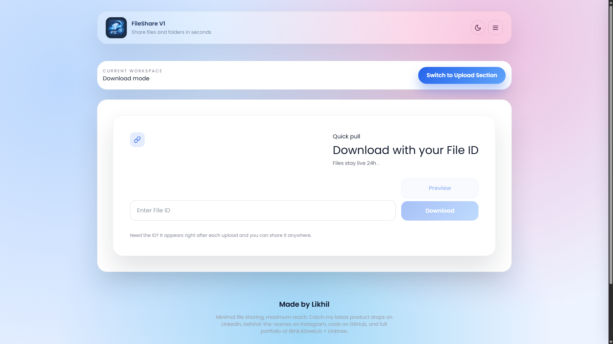

# FileShare V1



FileShare V1 is a frictionless browser-based file tunnel that lets anyone drop a single file or entire folder, generate a short-lived download ID, and preview the payload before pulling it back down. Uploads are staged securely on a PHP backend for 48 hours while the UI keeps things simple with tabless toggles, smooth light/dark theming, and instant feedback.

## Highlights

- **Folder-aware uploads** – Drop any directory and it is auto-zipped with structure preserved (thanks to JSZip) before hitting the server.
- **Preview-first downloads** – Typing an ID instantly requests metadata plus ZIP contents (first 200 files) so users confirm before downloading.
- **Timed availability** – UX shows a 24 hour countdown, while the server enforces a 48 hour retention window.
- **One-tap toggles** – Switch between upload/download workspaces and light/dark modes with a single control, stored per browser.
- **Secure handoff** – Randomized filenames, metadata cleanup, and expiring links keep shared files private.
- **Responsive surface** – Custom CSS grid with hover/focus helpers keeps the experience smooth even on low-spec devices.

## Tech Stack

| Layer | Details |
| --- | --- |
| Frontend | React + TypeScript (Vite), custom CSS + Tailwind reset, React Dropzone, React Toastify |
| Compression | JSZip (client-side folder bundling) |
| Backend | PHP endpoint (`server/fileShare.php`) storing uploads + metadata, ZipArchive for preview |
| Tooling | ESLint, TypeScript project refs, Vite build system |

## Screenshots

| Upload Flow | Download Flow |
| --- | --- |
|  |  |

## Project Structure

```
├── src/
│   ├── App.tsx               # Shell, toggles, toast + theme persistence
│   ├── components/
│   │   ├── UploadBox.tsx     # Drag-and-drop, folder zipping, progress UI
│   │   ├── DownloadBox.tsx   # Preview, metadata rendering, download handlers
│   │   ├── ProgressBar.tsx   # Lightweight status bar
│   │   └── Footer.tsx        # Social links + branding
│   ├── styles/global.css     # Theme tokens, layouts, effects
│   └── utils/fileUtils.ts    # Upload/download helpers, preview fetcher
├── public/ (static assets + favicon entry point)
├── server/fileShare.php      # Upload/download/info actions + cleanup
└── images/                   # Design assets & screenshots
```

## Getting Started

```bash
npm install
npm run dev
```

Visit `http://localhost:5173`.

### Environment Variables

Set `VITE_API_BASE_URL` if the PHP endpoint is not at `http://localhost:80/server/fileShare.php`.

```
VITE_API_BASE_URL=http://your-host.com/server/fileShare.php
```

## Backend Deployment Notes

1. Copy `server/fileShare.php` to your web root (e.g., `htdocs/server`).
2. Ensure PHP has write permissions for `server/uploads` and that the `zip` extension is enabled (`extension=zip`).
3. The endpoint responds to `POST` uploads, `GET ?id=` downloads, and `GET ?info=1&id=` previews.
4. Files and metadata auto-clean after 48 hours; adjust `$expirationHours` if needed.

## Available Scripts

| Command | Description |
| --- | --- |
| `npm run dev` | Start Vite dev server |
| `npm run build` | Production build (outputs to `dist/`) |
| `npm run preview` | Preview the build locally |

## Roadmap Ideas

- Optional passphrase-locked downloads
- Multi-file upload batching with progress per file
- WebSocket-driven live status for slow uploads
- Share history panel with copy/paste shortcuts

---

Made with ⚡ by Likhil — flow files without friction.
